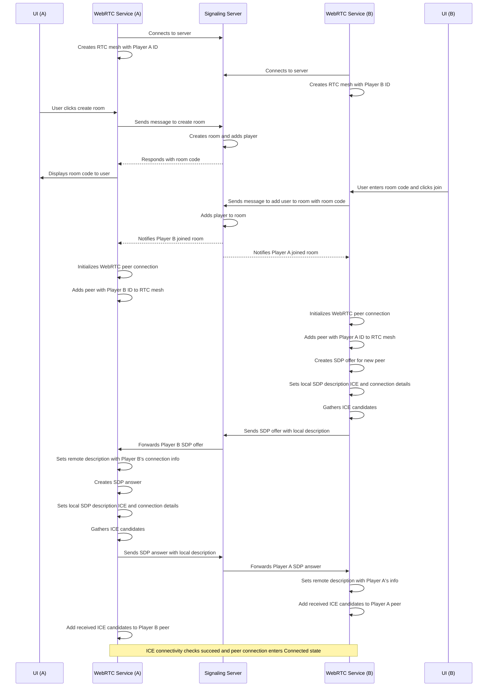

## WebRTC Connection Logic

The diagram below covers my understanding of the connection flow between the Godot clients and this signaling server.

Some notes:
- The peer who sends the offer is not determined by which user starts the room. It's currently arbitrarily done based on comparing numeric ID values (whichever player ID is higher, creates the offer).

